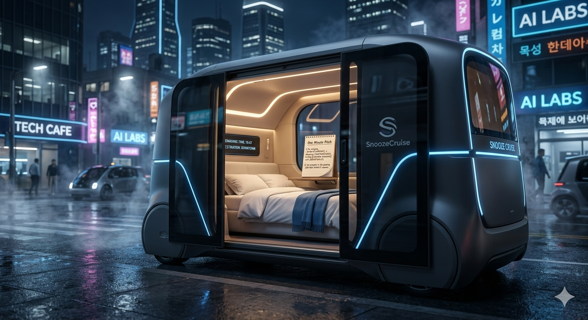
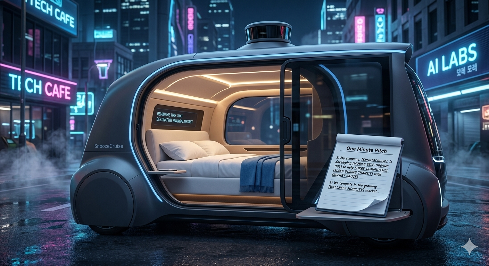
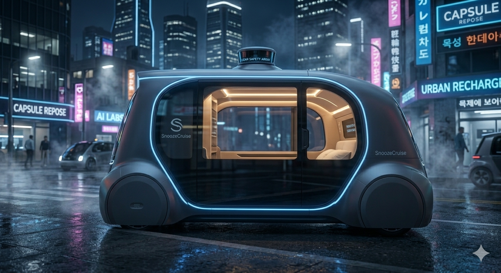

<!DOCTYPE html>
<html lang="en">
<head>
<meta charset="UTF-8">
<meta name="viewport" content="width=device-width, initial-scale=1.0">

<title>SnoozeCruise</title>

</head>

<body>

<header>

<h1>SnoozeCruise</h1>

SnoozeCruise is a luxury autonomous ride-sharing service designed for digital wellness. 
Instead of sitting in traffic, passengers can relax inside quiet, soundproof nap pods 
and recharge during their commute.

<button>Book Your Pod</button>

</header>

<section class="section">

<h2>How It Works</h2>

<h3>1. Summon</h3>

Open the SnoozeCruise app and request a pod instantly. 
The autonomous vehicle arrives at your location within minutes.

<h3>2. Sleep</h3>

Step into a comfortable soundproof pod with soft ambient lighting 
and a cozy bed designed for quick rest or relaxation.

<h3>3. Arrive</h3>

Wake up refreshed as the pod reaches your destination safely, 
turning your commute into a moment of rest.

</section>

<section class="section">

<h2>Pricing</h2>

<h3>Power Nap</h3>

Perfect for short city rides and quick energy boosts.

<h2>$5</h2>

<h3>Deep Sleep</h3>

Longer peaceful rides for uninterrupted relaxation.

<h2>$12</h2>

</section>

<footer>
© 2026 SnoozeCruise — Digital Wellness Mobility
</footer>

</body>
</html>
